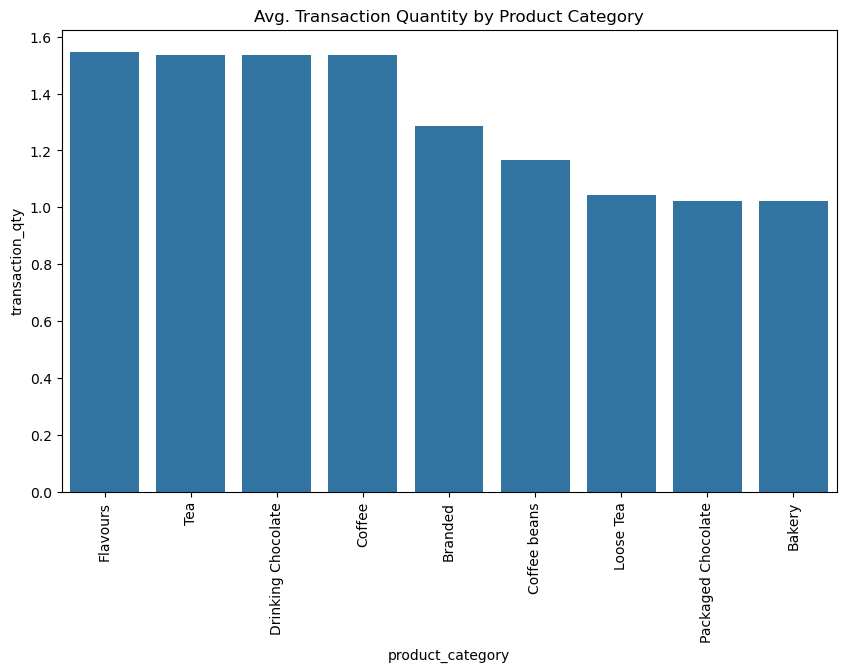

# Cafe Sales Analysis Project

## 1. Background and Overview

This project aims to analyze the performance and sales trends of coffee shops in 2023, using sales records and additional supplemental datasets. The goal is to uncover valuable insights that can help improve business operations, and profitability. The project was performed through **Exploratory Data Analysis (EDA)** in [Excel](image/sales-weather-excel.png) and [Python](EDA/EDA.ipynb), analyzed further in Python [Jupyter Notebook](sales_analysis/sales_analysis.ipynb). Additionally, the results were visualized using an interactive [Tableau dashboard](https://public.tableau.com/app/profile/kensuke.umakoshi/viz/coffee_17365392664280/Dashboard1), providing a comprehensive view of key performance indicators (KPIs) like Sales Growth Rate, Average Transaction Value, and Gross Profit Margin.

#### Tools:
- Excel
- Tableau 
- Python 
- Jupyter Notebook  

## 2. Data structure

### Sales Table:
- The central table, capturing details about transactions, including store information, products sold, and their pricing. Provides data for analyzing sales trends, product performance, and shop performance in sales.

### Weather Table:

- Contains weather-related information (e.g., temperature, rainfall) for different store locations on specific dates. Helps in understanding how weather conditions impact sales patterns.

### Holiday Table:
- Includes a list of holidays and their dates. Useful for assessing the effect of holidays on sales performance.

### Cost Table:
- Contains cost-related data for various items. Enables profitability analysis by combining cost data with sales figures.

## 3. Summary

Sales dropped by 38% from January to June but recovered with a 40% increase by December. Coffee and Tea were the top-performing categories with high order quantities but low gross profit margins. In contrast, Coffee Beans, despite generating the highest gross profits, contributed only 8.5% to the total. Astoria (Store ID: 3) showed consistent performance, but Lower Manhattan (Store ID: 5) and Hell's Kitchen (Store ID: 8) experienced sales declines of 30% and 33%, respectively, in June. Clear weather contributed to a 5% increase in overall profits.

## 4. Insights deep dive: [Jupyter Notebook](sales_analysis/sales_analysis.ipynb)
Coffee and tea are the most top-performing categories, contributing 35% and 25% to overall sales, respectively. In contrast, coffee beans and branded categories, despite generating significant gross profits, contribute only 8.5% and 3.7%. This suggests that increasing unit sales of coffee beans and brand category products will be a major key to improving profit margins in the future.

In terms of store performance, Astoria (store_id 3) experienced relatively consistent sales performance, while Lower Manhattan (store_id 5) exhibits the highest performance gap. Notably, Lower Manhattan and Hell's Kitchen (store_id 8) experienced significant sales drops in June, with declines of 30% and 33%, respectively. The overall trend also shows a decline in sales and customer counts from January through June, and it is necessary to identify the factors behind this decline and to examine the factors behind the dramatic slump in June based on further analysis.

Clear weather positively impacts performance, leading to an average sales increase of 5% compared to periods with rain or snow. Sales are also highly influenced by time, with 8:00 AM to 11:00 AM being the busiest period for purchases, followed by a sharp drop during 12:00 PM to 1:00 PM. After 7:30 PM, purchase activity decreases significantly, indicating a strong correlation between sales trends and customer schedules.

## 5. Recommendations
### i. Focus on High-Gross Profit Categories
Develop promotional campaigns to boost the sales of coffee beans and branded products, as they have the highest gross profit potential despite their lower sales contribution. Consider discounts, or loyalty rewards for purchasing these items.

### ii. Improve under-performing store 
Lower Manhattan (store_id 5) and Hell's Kitchen (store_id 8) need to enhance sales performance by
- Staff training to improve service quality or upselling techniques.
- Customer feedback collection to understand their specific needs and address potential dissatisfaction.

### iii. Optimize Peak / Off-Peak Time Opportunities
#### Peak Time (8:00 AM – 11:00 AM):
-  Offer limited-time discount to attract more customers and increase average transaction values during this high-activity period.
- Ensure adequate staffing and efficient service to handle the surge in customer demand.

#### Off-Peak Time (12:00 PM – 1:00 PM and After 7:30 PM):
- For evenings, consider offering small incentives for online or takeaway orders to boost sales without requiring extended operational hours.
